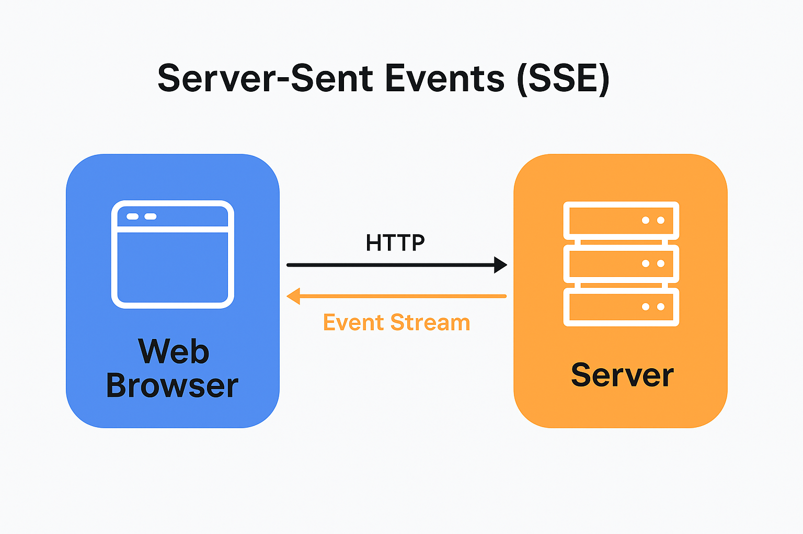

# 📱 Server-Sent Events (SSE) - Live Stock Ticker Demo

This is a simple demo of how **Server-Sent Events (SSE)** work using **Node.js** and **vanilla JavaScript**. The server pushes **live stock prices** to the frontend using the built-in `EventSource` API.



---

## 💡 What’s Inside

This project shows how to:

* Set up a basic **SSE server** with Node.js and Express
* Use the `EventSource` API on the browser
* Simulate real-time updates (like stock prices or cricket scores)

---

## 🧪 Real-World Use Cases

You can use this pattern for:

* 📈 Live stock or crypto prices
* 🏏 Live cricket scores
* 📊 Admin dashboards
* 🔔 Notification feeds
* 📰 News headlines
* 💬 Live reaction/comments

---

## 🚀 How to Run Locally

```bash
git clone https://github.com/yourusername/sse-stock-ticker.git
cd sse-stock-ticker
npm install
node server.js
```

Now open your browser and go to:
👉 **[http://localhost:3000](http://localhost:3000)**

You’ll see stock prices updating every 2 seconds — no refresh, no polling.

---

## 🔗 Learn More

* [MDN: Server-Sent Events](https://developer.mozilla.org/en-US/docs/Web/API/Server-sent_events)
* [EventSource API Docs](https://developer.mozilla.org/en-US/docs/Web/API/EventSource)

---

## 📬 License

MIT — use it, tweak it, share it.

---

**Feel free to fork this repo and try replacing stock prices with cricket scores, news updates, or anything live!**
